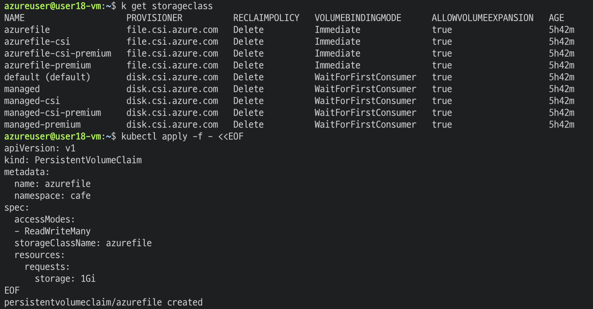
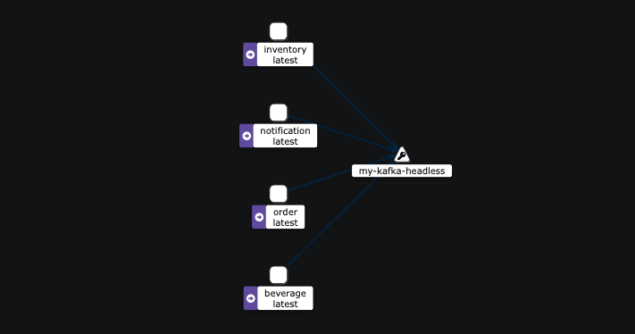
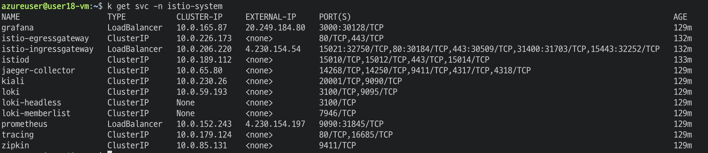

# 무인 카페 음료 주문 처리 시스템

## 1. 서비스 시나리오
1. 고객이 키오스크를 통해 메뉴를 선택하여 주문한다.
2. 주문이 되면 음료를 담을 컵의 재고를 체크한다.
3. 음료를 담을 컵이 부족할 경우, 주문을 취소한다.
4. 주문이 취소되면 고객에게 알림을 발송한다.
5. 음료를 답을 컵이 충분한 경우, 음료 제조를 진행한다.
6. 음료 제조가 완료되면 고객에게 알림을 발송한다.

## 2. 클라우드 네이티브 아키텍처 설계
- gateway를 통해 단일 진입점을 두고, 총 5개의 서비스를 가지도록 설계한다(MSA):
	- order: 주문 서비스
	- beverage: 음료 서비스
	- notification: 알림 서비스
	- inventory: 재고 서비스
	- kiosk: 키오스크 주문 화면 서비스
- 각 서비스는 각 서비스만의 데이터베이스(embedded H2)를 가져 서비스 간 결합성을 낮춘다.
- 각 서비스 간 통신은 kafka를 이용한 Pub/Sub을 통해 event-driven 아키텍처로 구성하여 결합도를 낮춘다.
	- 이에 따라 서비스 중 하나가 장애가 발생하더라도 kafka가 event를 들고 있어 추후 서비스 복구 이후 event가 consume 될때 재개될 수 있도록 한다.
- Docker container 기술을 사용하여 서비스 배포 환경을 항시 동일한 환경으로 유지되도록 한다.
- Docker container image를 ACR(Azure cloud registry)에 저장하여 컨테이너 버전 관리를 수행한다.
- Azure 기반 환경 속에서 AKS(Azure Kubernetes Service)를 활용하여 컨테이너 오케스트레이션을 도입한다.
- Jenkins와 AKS를 활용하여 자동 CI/CD 환경을 구축한다.
- Azure 환경 속에서 HPA를 도입해 컨테이너 자동 확장 환경을 구축한다.
- Azure 환경 속에서 PVC를 사용하여 Azure 기반 클라우드 스토리지를 활용한다.
- AKS 기반 배포에서 liveness/readiness probe를 구성하여 셀프 힐링 및 무정지 배포를 구현한다.
- 컨테이너로부터 환경분리를 ConfigMap을 활용하여 수행한다.
- istio를 사용하여 service mesh를 구축하고, grafana를 이용한 모니터링 환경을 구축한다.

## 3. 클라우드 네이티브 모델링 - 이벤트 스토밍 기반 도메인 분석
  

## 4. 클라우드 네이티브 개발

### 단일 진입점 - Gateway
```yaml
# gateway/src/main/resources/application.yml
server:
  port: 8088

---

spring:
  profiles: default
  cloud:
    gateway:
#<<< API Gateway / Routes
      routes:
        - id: order
          uri: http://localhost:8082
          predicates:
            - Path=/orders/**, 
        - id: beverage
          uri: http://localhost:8083
          predicates:
            - Path=/beverages/**, 
        - id: notification
          uri: http://localhost:8084
          predicates:
            - Path=/notifications/**, 
        - id: kiosk
          uri: http://localhost:3000
          predicates:
            - Path=, 
        - id: inventory
          uri: http://localhost:8085
          predicates:
            - Path=/inventories/**, 
        - id: frontend
          uri: http://localhost:8080
          predicates:
            - Path=/**
#>>> API Gateway / Routes
      globalcors:
        corsConfigurations:
          '[/**]':
            allowedOrigins:
              - "*"
            allowedMethods:
              - "*"
            allowedHeaders:
              - "*"
            allowCredentials: true


---

spring:
  profiles: docker
  cloud:
    gateway:
      routes:
        - id: order
          uri: http://order:8080
          predicates:
            - Path=/undefined/**, 
        - id: beverage
          uri: http://beverage:8080
          predicates:
            - Path=/beverages/**, 
        - id: notification
          uri: http://notification:8080
          predicates:
            - Path=/notifications/**, 
        - id: kiosk
          uri: http://kiosk:8080
          predicates:
            - Path=, 
        - id: inventory
          uri: http://inventory:8080
          predicates:
            - Path=, 
        - id: frontend
          uri: http://frontend:8080
          predicates:
            - Path=/**
      globalcors:
        corsConfigurations:
          '[/**]':
            allowedOrigins:
              - "*"
            allowedMethods:
              - "*"
            allowedHeaders:
              - "*"
            allowCredentials: true

server:
  port: 8080

```
위와 같이 gateway 환경을 맞추어, order, beverage, notification 서비스를 모두 띄운 후 gateway 포트인 8080 포트로 각 서비스에 접근되는지 확인한다.  
테스트는 명확한 포트 구분을 확인하기 위해 로컬 환경에서 진행한다.  
테스트는 httpie를 활용한다.  
- gateway port: 8088
- order port: 8082
- beverage port: 8083
- notification port: 8084
- inventory port: 8085
#### http order
```sh
http :8088/orders
```
  
#### http beverage
```sh
http :8088/beverages
```
  
#### http notification
```sh
http :8088/notifications
```
  
#### http inventory
```sh
http :8088/inventories
```
  

위와 같이 gateway에 해당하는 8088 포트만으로도 application.yml에 지정된 predicates를 통해 각 서비스를 진입함을 확인할 수 있다.

### 분산 데이터 프로젝션 - CQRS
kiosk에 해당하는 별도의 read model 프론트엔드를 두어 고객이 주문서비스 및 주문 제작 여부 알림을 통해 데이터 원본에 접근없이도 서비스의 화면 구성과 잦은 조회가 가능하도록 한다.

### 분산 트랜젝션 - SAGA
Choreography Saga를 통해 중앙 제어없이 서비스끼리 kafka event로 Pub/Sub 구조 통신을 하여 분산 트랜젝션을 구현한다.

### 보상처리 - Compensation
고객이 음료를 주문하면 모든 주문은 처음 접수 시 주문상태에 해당하는 orderStatus 값이 'pending'으로 반영된다.  
이후 재고 서비스인 inventory 서비스에서 음료를 담을 컵의 재고를 확인하고, 만약 컵이 부족하면 주문을 취소하며 orderStatus를 'cancelled'로 변경한다.  
이렇게 주문의 접수 상태를 재고 상황에 따라 업데이트 함으로써 보상처리를 수행한다.  

### 정상 구동 테스트 프로세스

#### 컵 재고 부족으로 인한 자동 취소 프로세스
1. 컵 재고 생성(10개)  
  
2. 1번 고객이 아메리카노 11잔 주문 시도  
  
3. 컵 재고 부족으로 인해 해당 주문 건 취소 처리  
4. 주문 취소 알림 발송  
  

#### 컵 재고가 충분하여 음료를 정상적으로 조제하는 프로세스
1. 2번 고객이 아이스티 1잔 주문 시도  
  
2. 컵 재고 충분으로 해당 주문 건 제조 수행  
3. 음료 제조 완료 후 주문 상태를 completed로 변경하고, 고객에게 알림 발송  
  

## 5. 클라우드 네이티브 운영

### 클라우드 배포 역량

#### 1. azure portal 내 리소스 그룹(rsrcgrp), 클라우드 레지스트리(acr), 쿠버네티스(aks), 가상머신(vm) 구성
  
#### 2. 가상 머신 생성 시 다운받은 pem 키를 통해 vm 접근
```sh
ssh -i <pem키_접속경로> azureuser@<vm_ip_addr>
```
#### 3. 가상 머신 내 필요한 자료 설치
```sh
# kubectl 설치

# kubectl 다운
curl -LO "https://dl.k8s.io/release/$(curl -L -s https://dl.k8s.io/release/stable.txt)/bin/linux/amd64/kubectl"

# kubectl 설치
sudo install -o root -g root -m 0755 kubectl /usr/local/bin/kubectl

# 설치 후 버전 확인
kubectl version --client
```
```sh
# helm 설치 (k8s에 kafka 설치 목적)

# helm 설치 shell script 다운로드
curl https://raw.githubusercontent.com/helm/helm/master/scripts/get-helm-3 > get_helm.sh

# helm 설치 shell script 실행 권한 부여
chmod 700 get_helm.sh

# helm 설치
./get_helm.sh
```
```sh
# docker 설치

# repo 업데이트
sudo apt-get update -y

# docker.io 설치
sudo apt-get install docker.io
```
```sh
# azure cli 설치

# azure cli 설치 파일 다운로드
curl -sL https://aka.ms/InstallAzureCLIDeb | sudo bash 

# 설치 완료 후 버전 확인
az version
```
```sh
# jenkins 설치

# jenkins에 필요한 jdk 17 설치
sudo apt-get install openjdk-17-jdk

# repo keyring 다운로드
curl -fsSL https://pkg.jenkins.io/debian/jenkins.io-2023.key | sudo tee \
    /usr/share/keyrings/jenkins-keyring.asc > /dev/null
		
# jenkins repo 등록
echo deb [signed-by=/usr/share/keyrings/jenkins-keyring.asc] \
    https://pkg.jenkins.io/debian binary/ | sudo tee \
    /etc/apt/sources.list.d/jenkins.list > /dev/null

# repo 업데이트
sudo apt-get update

# jenkins 설치
sudo apt-get install jenkins

# jenkins가 host의 쉘 스크립트를 수행할 수 있도록 관리자 권한 부여
sudo sed -i '$ a jenkins ALL=(ALL) NOPASSWD: ALL' /etc/sudoers

# docker.sock 접근 권한을 부여하기 위해 user 'jenkins'를 docker group에 추가
sudo usermod -aG docker jenkins

# jenkins service 재시작 (권한 갱신 목적)
sudo systemctl restart jenkins
```

```sh
# Maven 설치

# maven bin 설치파일 다운로드
wget https://dlcdn.apache.org/maven/maven-3/3.8.8/binaries/apache-maven-3.8.8-bin.tar.gz

# tar 파일 압축 해제
tar -xvf apache-maven-3.8.8-bin.tar.gz

# 설치파일을 /opt/ 경로 아래로 이동
sudo mv apache-maven-3.8.8 /opt/
```

#### 4. Jenkins 내부 설정
1. 초기 비밀번호로 로그인 후, Install suggested plugins로 기초 플러그인 설치 수행
2. Github의 개발자 설정 내에서 github access token 생성
3. Jenkins credentials에 GitHub-Cred 추가 (scm polling 시 필요)
4. Jenkins 관리 > Tools > Maven Installations > Add Maven: install automatically 체크 해제 후 Name에 'Maven', 'MAVEN_HOME'에 설치되어있는 경로인 `/opt/apache-maven-3.8.8` 입력
5. 추가 플러그인 설치: Maven Integration, Pipeline Maven Integration, Docker Pipeline, Kubernetes, Kubernetes CLI, Azure CLI, Azure Credentials
6. Azure service principal 생성: `az ad sp create-for-rbac --name <ServicePrincipalName> --role contributor --scopes /subscriptions/<SubscriptionID>`
7. az cli에 로그인 후, k8s 설정 정보 동기화, 6번에서 가져온 service principal 정보로 jenkins credentials에 Azure-Cred 추가 수행
8. Jenkins 새로운 Item 생성 후, git scm polling 구조로 Jenkinsfile을 읽어와서 파이프라인 자동 CI/CD 구축
```yaml
pipeline {
    agent any

    environment {
        REGISTRY = 'user18.azurecr.io'
        IMAGE_NAME_GATEWAY = 'gateway'
        IMAGE_NAME_ORDER = 'order'
        IMAGE_NAME_INVENTORY = 'inventory'
        IMAGE_NAME_BEVERAGE = 'beverage'
        IMAGE_NAME_NOTIFICATION = 'notification'
        AKS_CLUSTER = 'user18-aks'
        RESOURCE_GROUP = 'user18-rsrcgrp'
        AKS_NAMESPACE = 'cafe'
        AZURE_CREDENTIALS_ID = 'Azure-Cred'
        TENANT_ID = 'f46af6a3-e73f-4ab2-a1f7-f33919eda5ac'
    }

    stages {
        stage('Clone Repository') {
            steps {
                checkout scm
            }
        }
        
        stage('Maven Build') {
            steps {
                withMaven(maven: 'Maven') {
                    script {
                        parallel(
                            'gateway': {
                                dir('gateway') {
                                    sh 'mvn clean package -DskipTests'
                                }
                            },
                            'order': {
                                dir('order') {
                                    sh 'mvn clean package -DskipTests'
                                }
                            },
                            'inventory': {
                                dir('inventory') {
                                    sh 'mvn clean package -DskipTests'
                                }
                            },
                            'notification': {
                                dir('notification') {
                                    sh 'mvn clean package -DskipTests'
                                }
                            },
                            'beverage': {
                                dir('beverage') {
                                    sh 'mvn clean package -DskipTests'
                                }
                            }
                        )
                    }
                }
            }
        }
        
        stage('Docker Build') {
            steps {
                script {
                    parallel(
                        'gateway': {
                            dir('gateway') {
                                gatewayImage = docker.build("${REGISTRY}/${IMAGE_NAME_GATEWAY}:v${env.BUILD_NUMBER}")
                            }
                        },
                        'order': {
                            dir('order') {
                                orderImage = docker.build("${REGISTRY}/${IMAGE_NAME_ORDER}:v${env.BUILD_NUMBER}")
                            }
                        },
                        'inventory': {
                            dir('inventory') {
                                inventoryImage = docker.build("${REGISTRY}/${IMAGE_NAME_INVENTORY}:v${env.BUILD_NUMBER}")
                            }
                        },
                        'notification': {
                            dir('notification') {
                                notificationImage = docker.build("${REGISTRY}/${IMAGE_NAME_NOTIFICATION}:v${env.BUILD_NUMBER}")
                            }
                        },
                        'beverage': {
                            dir('beverage') {
                                beverageImage = docker.build("${REGISTRY}/${IMAGE_NAME_BEVERAGE}:v${env.BUILD_NUMBER}")
                            }
                        }
                    )
                }
            }
        }
        
        stage('Azure Login') {
            steps {
                script {
                    withCredentials([usernamePassword(credentialsId: env.AZURE_CREDENTIALS_ID, usernameVariable: 'AZURE_CLIENT_ID', passwordVariable: 'AZURE_CLIENT_SECRET')]) {
                        sh 'az login --service-principal -u $AZURE_CLIENT_ID -p $AZURE_CLIENT_SECRET --tenant ${TENANT_ID}'
                    }
                }
            }
        }
        
        stage('Push to ACR') {
            steps {
                script {
                    sh "az acr login --name ${REGISTRY.split('\\.')[0]}"
                    sh "docker push ${REGISTRY}/${IMAGE_NAME_GATEWAY}:v${env.BUILD_NUMBER}"
                    sh "docker push ${REGISTRY}/${IMAGE_NAME_ORDER}:v${env.BUILD_NUMBER}"
                    sh "docker push ${REGISTRY}/${IMAGE_NAME_BEVERAGE}:v${env.BUILD_NUMBER}"
                    sh "docker push ${REGISTRY}/${IMAGE_NAME_INVENTORY}:v${env.BUILD_NUMBER}"
                    sh "docker push ${REGISTRY}/${IMAGE_NAME_NOTIFICATION}:v${env.BUILD_NUMBER}"
                }
            }
        }
        
        stage('CleanUp Images') {
            steps {
                sh """
                docker rmi ${REGISTRY}/${IMAGE_NAME_GATEWAY}:v$BUILD_NUMBER
                docker rmi ${REGISTRY}/${IMAGE_NAME_ORDER}:v$BUILD_NUMBER
                docker rmi ${REGISTRY}/${IMAGE_NAME_BEVERAGE}:v$BUILD_NUMBER
                docker rmi ${REGISTRY}/${IMAGE_NAME_INVENTORY}:v$BUILD_NUMBER
                docker rmi ${REGISTRY}/${IMAGE_NAME_NOTIFICATION}:v$BUILD_NUMBER
                """
            }
        }
        
        stage('Deploy to AKS') {
            steps {
                script {
                    sh "az aks get-credentials --resource-group ${RESOURCE_GROUP} --name ${AKS_CLUSTER}"
                    parallel(
                        'gateway': {
                            dir('gateway') {
                                sh """
                                sed 's/latest/v${env.BUILD_ID}/g' kubernetes/deployment.yaml > output.yaml
                                cat output.yaml
                                kubectl apply -f output.yaml -n ${AKS_NAMESPACE}
                                kubectl apply -f kubernetes/service.yaml -n ${AKS_NAMESPACE}
                                rm output.yaml
                                """
                            }
                        },
                        'order': {
                            dir('order') {
                                sh """
                                sed 's/latest/v${env.BUILD_ID}/g' kubernetes/deployment.yaml > output.yaml
                                cat output.yaml
                                kubectl apply -f output.yaml -n ${AKS_NAMESPACE}
                                kubectl apply -f kubernetes/service.yaml -n ${AKS_NAMESPACE}
                                rm output.yaml
                                """
                            }
                        },
                        'inventory': {
                            dir('inventory') {
                                sh """
                                sed 's/latest/v${env.BUILD_ID}/g' kubernetes/deployment.yaml > output.yaml
                                cat output.yaml
                                kubectl apply -f output.yaml -n ${AKS_NAMESPACE}
                                kubectl apply -f kubernetes/service.yaml -n ${AKS_NAMESPACE}
                                rm output.yaml
                                """
                            }
                        },
                        'notification': {
                            dir('notification') {
                                sh """
                                sed 's/latest/v${env.BUILD_ID}/g' kubernetes/deployment.yaml > output.yaml
                                cat output.yaml
                                kubectl apply -f output.yaml -n ${AKS_NAMESPACE}
                                kubectl apply -f kubernetes/service.yaml -n ${AKS_NAMESPACE}
                                rm output.yaml
                                """
                            }
                        },
                        'beverage': {
                            dir('beverage') {
                                sh """
                                sed 's/latest/v${env.BUILD_ID}/g' kubernetes/deployment.yaml > output.yaml
                                cat output.yaml
                                kubectl apply -f output.yaml -n ${AKS_NAMESPACE}
                                kubectl apply -f kubernetes/service.yaml -n ${AKS_NAMESPACE}
                                rm output.yaml
                                """
                            }
                        }
                    )
                }
            }
        }
    }
}
```
9. Github repo 설정 내 github-webhook 설정하여 push event 발생 시 Jenkins가 빌드하도록 구성
#### 5. aks 위에서 구동되는 cafe 프로젝트 네트워크 정상 수행 검증

  
- gateway의 external-IP를 통과하여 orders를 정상적으로 접근하는 모습 확인
#### 6. 컨테이너 자동 확장 - HPA 
- 현 상황 확인: 각 instance 별 deployment.yaml에는 `replicas: 1`로 잡혀있다.

1. 각 서비스 별 HPA 구축 수행: 최소 pod 1개, 최대 pod 3개, 가변 기준치 cpu 50% 부하 이상
```sh
kubectl autoscale deployment order -n cafe --cpu-percent=50 --min=1 --max=3
kubectl autoscale deployment beverage -n cafe --cpu-percent=50 --min=1 --max=3
kubectl autoscale deployment inventory -n cafe --cpu-percent=50 --min=1 --max=3
kubectl autoscale deployment notification -n cafe --cpu-percent=50 --min=1 --max=3
```
2. 각 instance의 deployment.yaml에 `resources.requests.cpu="200m"` 지정
  
3. `kubectl get hpa -n cafe`로 hpa 생성 확인 및 metrics server 감지 확인
  
4. 부하 테스트 목적 siege pod 생성
```sh
kubectl apply -f - <<EOF
apiVersion: v1
kind: Pod
metadata:
  name: siege
  namespace: cafe
spec:
  containers:
  - name: siege
    image: apexacme/siege-nginx
EOF
```
5. siege로 order 서비스에 부하 적용 후, auto scaling 확인
```sh
# siege pod에 bash 접속
kubectl exec -it siege -n cafe -- /bin/bash

# 40초간 20명의 user로 부하 테스트 시작
siege -c20 -t40S -v http://20.249.181.191:8080/orders

# 다른 터미널을 열고, pod 증가 확인
kubectl get pods -n cafe -w
```

  
부하가 증가함에 따라 order의 pod replica가 3개로 scale-up 된 것을 확인할 수 있다. 부하 테스트 종료 후 약 5분 정도의 대기시간 이후에 HPA가 더 이상 3개를 유지할 필요가 없음을 감지하고, 1개로 scale-down 되는 모습까지 확인할 수 있다.

#### 7. 컨테이너로부터 환경분리 - ConfigMap/Secrets
컨테이너 배포 운영 과정에서 단순 환경변수 변경을 위한 재배포는 효율이 떨어진다. 따라서, ConfigMap을 통해 환경변수를 변경하는 테스트를 수행한다.  
  
아래 예시는 단순히 order instance의 로깅 레벨을 DEBUG 수준으로 내리는 작업을 수행한다.  
1. order-log-config 적용
```sh
kubectl apply -f <<EOF
apiVersion: v1
kind: ConfigMap
metadata:
  name: order-log-config
	namespace: cafe
data:
  application.yml: |
    logging:
      level:
        root: INFO
        com.example: DEBUG
EOF
```
2. order의 deployment.yaml을 아래처럼 수정하여 ConfigMap을 도입하도록 변경 배포 수행
```yaml
apiVersion: apps/v1
kind: Deployment
metadata:
  name: order
  labels:
    app: order
spec:
  replicas: 1
  selector:
    matchLabels:
      app: order
  template:
    metadata:
      labels:
        app: order
    spec:
      containers:
        - name: order
          image: "user18.azurecr.io/order:latest"
          ports:
            - containerPort: 8080
          resources:
            requests:
              cpu: "200m"
          readinessProbe:
            httpGet:
              path: '/actuator/health'
              port: 8080
            initialDelaySeconds: 10
            timeoutSeconds: 2
            periodSeconds: 5
            failureThreshold: 10
          livenessProbe:
            httpGet:
              path: '/actuator/health'
              port: 8080
            initialDelaySeconds: 120
            timeoutSeconds: 2
            periodSeconds: 5
            failureThreshold: 5
          volumeMounts:
            - name: config-volume
              mountPath: /config
              subPath: application.yml
      volumes:
        - name: config-volume
          configMap:
            name: order-log-config
            items:
              - key: application.yml
                path: application.yml
      env:
        - name: SPRING_CONFIG_LOCATION
          value: "classpath:/application.yml,/config/application.yml"
```
```sh
# 로그 레벨 확인
kubectl logs -l app=order -n cafe --all-containers
```

#### 8. 클라우드 스토리지 활용 - PVC(Persistent Volume Claim)
1. PVC 생성

2. PVC 생성 확인

3. 아래 yaml 수행으로 order instance가 위에서 생성한 pvc를 사용하도록 설정
```yaml
kubectl apply -f - <<EOF
apiVersion: apps/v1
kind: Deployment
metadata:
  name: order
  namespace: cafe
  labels:
    app: order
spec:
  replicas: 1
  selector:
    matchLabels:
      app: order
  template:
    metadata:
      labels:
        app: order
    spec:
      containers:
        - name: order
          image: "user18.azurecr.io/order:v13"
          ports:
            - containerPort: 8080
          resources:
            requests:
              cpu: "200m"
          readinessProbe:
            httpGet:
              path: '/actuator/health'
              port: 8080
            initialDelaySeconds: 10
            timeoutSeconds: 2
            periodSeconds: 5
            failureThreshold: 10
          livenessProbe:
            httpGet:
              path: '/actuator/health'
              port: 8080
            initialDelaySeconds: 120
            timeoutSeconds: 2
            periodSeconds: 5
            failureThreshold: 5
          volumeMounts:
            - mountPath: "/mnt/data"
              name: volume
      volumes:
        - name: volume
          persistentVolumeClaim:
            claimName: azurefile
EOF
```
4. PVC 내 파일 생성 테스트 수행

5. order service scale-up

6. scale-up 되어 추가로 생성된 두번째 pod에 접속하여 기존 pod에서 생성했던 test.txt 확인

#### 9. 셀프 힐링/무정지배포 - Liveness/Readiness Probe
  
각 instance의 deployment.yaml에 위와 같이 liveness/readiness probe를 지정하여 셀프 힐링 및 무정지 배포를 보장한다.

#### 10. 서비스 메쉬 응용 - Mesh with Istio
```sh
# istio 버전 명시
export ISTIO_VERSION=1.20.8

# istio 다운로드
curl -L https://istio.io/downloadIstio | ISTIO_VERSION=$ISTIO_VERSION TARGET_ARCH=x86_64 sh -

# 디렉토리 이동
cd istio-$ISTIO_VERSION

# istioctl 클라이언트 PATH 명시
export PATH=$PWD/bin:$PATH

# demo 기반 기초 설치
istioctl install --set profile=demo --set hub=gcr.io/istio-release

# GUI 기반 모니터링 도구 반영
mv samples/addons/loki.yaml samples/addons/loki.yaml.old

curl -o samples/addons/loki.yaml https://raw.githubusercontent.com/msa-school/Lab-required-Materials/main/Ops/loki.yaml

kubectl apply -f samples/addons

# 설치 확인
kubectl get svc -n istio-system

# ingress gateway 설치
helm repo add stable https://charts.helm.sh/stable
helm repo add ingress-nginx https://kubernetes.github.io/ingress-nginx
helm repo update
kubectl create namespace ingress-basic

# nginx ingress controller 설치
helm install ingress-nginx ingress-nginx/ingress-nginx --namespace ingress-basic \
  --set controller.service.annotations."service\.beta\.kubernetes\.io/azure-load-balancer-health-probe-request-path"=/healthz

# Istio Dashboard를 위한 라우팅 룰(Ingress) 설정
kubectl apply -f - <<EOF
apiVersion: networking.k8s.io/v1
kind: "Ingress"
metadata: 
  name: "shopping-ingress"
  namespace: istio-system
  annotations: 
    nginx.ingress.kubernetes.io/ssl-redirect: "false"
    ingressclass.kubernetes.io/is-default-class: "true"
spec: 
  ingressClassName: nginx
  rules: 
    - host: ""
      http: 
        paths: 
          - path: /kiali
            pathType: Prefix
            backend: 
              service:
                name: kiali
                port:
                  number: 20001
          - path: /grafana
            pathType: Prefix
            backend: 
              service:
                name: grafana
                port:
                  number: 3000
          - path: /prometheus
            pathType: Prefix
            backend: 
              service:
                name: prometheus
                port:
                  number: 9090
          - path: /loki
            pathType: Prefix
            backend: 
              service:
                name: loki
                port:
                  number: 3100
EOF

# Ingress LoadBalancer IP를 가져오기 위해 ingress 조회
kubectl get ingress -n istio-system

# 이후 보여지는 IP로 /kiali path를 먹여 kiali에 접속할 수 있다.
```

- Sidecar injection은 각 instance의 deployment.yaml에 라벨을 붙혀 적용한다. order instance 예시:
  
- 정상적으로 Sidecar가 주입되면 kiali 화면에서 다음과 같은 서비스 그래프를 볼 수 있다:
  
- 또한, replicas=1 이더라도 Sidecar 주입 시 pod는 Ready 값이 2/2로 표기된다:


#### 11. 통합 모니터링 - Istio 기반 Grafana
- LoadBalancer type의 External-IP는 갯수 제한이 있어 10번에서 수행했었던 Jaeger와 Kiali를 ClusterIP type으로 변경하여 회수한다.
```sh
kubectl patch svc kiali -n istio-system -p '{"spec": {"type": "ClusterIP"}}'
kubectl patch svc tracing -n istio-system -p '{"spec": {"type": "ClusterIP"}}'
```
- 모니터링에 사용할 Prometheus와 Grafana의 type을 LoadBalancer로 변경하여 접근가능한 External-IP를 얻어온다.
```sh
kubectl patch service/prometheus -n istio-system -p '{"spec": {"type": "LoadBalancer"}}'
kubectl patch service/grafana -n istio-system -p '{"spec": {"type": "LoadBalancer"}}'
```
- `kubectl get svc -n istio-system`을 수행하여 Prometheus와 Grafana의 External-IP를 조회한다.


##### Prometheus 활용 예시
- istio_requests_total 메트릭으로 전체 조회 예시
  
- 라벨을 지정하여 order instance에서 발생한 메트릭 조회 예시  

- siege로 order instance에 부하를 걸고, 라벨을 지정하여 order instance에 발생항 메트릭을 그래프로 조회 예시  


##### Grafana 활용 예시
- Grafana로 Prometheus 메트릭을 시각화하여 사람이 모니터링 하기에 더 나은 환경을 구축할 수 있다.
- 6417번 Kubernetes Cluster 메트릭 분석 대시보드를 import하여 시각화한 예시  

- 315번 K8s cluster 모니터링용 대시보드를 import하여 시각화한 예시  

	- 위 그래프의 Network I/O pressure 그래프의 우측에 관찰되는 증가하는 네트워크 부하는 siege로 부하테스트를 수행했을 시 관측된 화면이다.
- 위와 같이 Grafana dashboard를 직접 커스터마이징하여 보고싶은 데이터의 시각화를 통해 모니터링을 수행할 수 있다.
- 모니터링 수행 중 특정 값이 지정한 수치를 넘어서는 경우 slack이나 email 등으로 사용자에게 알림을 구성할 수 있다.