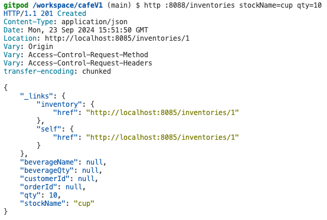

# 무인 카페 음료 주문 처리 시스템

## 1. 서비스 시나리오
1. 고객이 키오스크를 통해 메뉴를 선택하여 주문한다.
2. 주문이 되면 음료를 담을 컵의 재고를 체크한다.
3. 음료를 담을 컵이 부족할 경우, 주문을 취소한다.
4. 주문이 취소되면 고객에게 알림을 발송한다.
5. 음료를 답을 컵이 충분한 경우, 음료 제조를 진행한다.
6. 음료 제조가 완료되면 고객에게 알림을 발송한다.

## 2. 클라우드 네이티브 아키텍처 설계
- gateway를 통해 단일 진입점을 두고, 총 5개의 서비스를 가지도록 설계한다(MSA):
		- order: 주문 서비스
		- beverage: 음료 서비스
		- notification: 알림 서비스
		- inventory: 재고 서비스
		- kiosk: 키오스크 주문 화면 서비스
- 각 서비스는 각 서비스만의 데이터베이스(embedded H2)를 가져 서비스 간 결합성을 낮춘다.
- 각 서비스 간 통신은 kafka를 이용한 Pub/Sub을 통해 event-driven 아키텍처로 구성하여 결합도를 낮춘다.
		- 이에 따라 서비스 중 하나가 장애가 발생하더라도 kafka가 event를 들고 있어 추후 서비스 복구 이후 event가 consume 될때 재개될 수 있도록 한다.
- Docker container 기술을 사용하여 서비스 배포 환경을 항시 동일한 환경으로 유지되도록 한다.
- Docker container image를 ACR(Azure cloud registry)에 저장하여 컨테이너 버전 관리를 수행한다.
- Azure 기반 환경 속에서 AKS(Azure Kubernetes Service)를 활용하여 컨테이너 오케스트레이션을 도입한다.
- Jenkins와 AKS를 활용하여 자동 CI/CD 환경을 구축한다.
- Azure 환경 속에서 HPA를 도입해 컨테이너 자동 확장 환경을 구축한다.
- Azure 환경 속에서 PVC를 사용하여 Azure 기반 클라우드 스토리지를 활용한다.
- AKS 기반 배포에서 liveness/readiness probe를 구성하여 셀프 힐링 및 무정지 배포를 구현한다.
- 컨테이너로부터 환경분리를 ConfigMap을 활용하여 수행한다.
- istio를 사용하여 service mesh를 구축하고, grafana를 이용한 모니터링 환경을 구축한다.

## 3. 클라우드 네이티브 모델링 - 이벤트 스토밍 기반 도메인 분석


## 4. 클라우드 네이티브 개발

### 단일 진입점 - Gateway
```yaml
# gateway/src/main/resources/application.yml
server:
  port: 8088

---

spring:
  profiles: default
  cloud:
    gateway:
#<<< API Gateway / Routes
      routes:
        - id: order
          uri: http://localhost:8082
          predicates:
            - Path=/orders/**, 
        - id: beverage
          uri: http://localhost:8083
          predicates:
            - Path=/beverages/**, 
        - id: notification
          uri: http://localhost:8084
          predicates:
            - Path=/notifications/**, 
        - id: kiosk
          uri: http://localhost:3000
          predicates:
            - Path=, 
        - id: inventory
          uri: http://localhost:8085
          predicates:
            - Path=/inventories/**, 
        - id: frontend
          uri: http://localhost:8080
          predicates:
            - Path=/**
#>>> API Gateway / Routes
      globalcors:
        corsConfigurations:
          '[/**]':
            allowedOrigins:
              - "*"
            allowedMethods:
              - "*"
            allowedHeaders:
              - "*"
            allowCredentials: true


---

spring:
  profiles: docker
  cloud:
    gateway:
      routes:
        - id: order
          uri: http://order:8080
          predicates:
            - Path=/undefined/**, 
        - id: beverage
          uri: http://beverage:8080
          predicates:
            - Path=/beverages/**, 
        - id: notification
          uri: http://notification:8080
          predicates:
            - Path=/notifications/**, 
        - id: kiosk
          uri: http://kiosk:8080
          predicates:
            - Path=, 
        - id: inventory
          uri: http://inventory:8080
          predicates:
            - Path=, 
        - id: frontend
          uri: http://frontend:8080
          predicates:
            - Path=/**
      globalcors:
        corsConfigurations:
          '[/**]':
            allowedOrigins:
              - "*"
            allowedMethods:
              - "*"
            allowedHeaders:
              - "*"
            allowCredentials: true

server:
  port: 8080

```
위와 같이 gateway 환경을 맞추어, order, beverage, notification 서비스를 모두 띄운 후 gateway 포트인 8080 포트로 각 서비스에 접근되는지 확인한다.  
테스트는 명확한 포트 구분을 확인하기 위해 로컬 환경에서 진행한다.  
테스트는 httpie를 활용한다.  
- gateway port: 8088
- order port: 8082
- beverage port: 8083
- notification port: 8084
- inventory port: 8085
#### http order
```sh
http :8088/orders
```

#### http beverage
```sh
http :8088/beverages
```

#### http notification
```sh
http :8088/notifications
```

#### http inventory
```sh
http :8088/inventories
```


위와 같이 gateway에 해당하는 8088 포트만으로도 application.yml에 지정된 predicates를 통해 각 서비스를 진입함을 확인할 수 있다.

### 분산 데이터 프로젝션 - CQRS
kiosk에 해당하는 별도의 read model 프론트엔드를 두어 고객이 주문서비스 및 주문 제작 여부 알림을 통해 데이터 원본에 접근없이도 서비스의 화면 구성과 잦은 조회가 가능하도록 한다.

### 분산 트랜젝션 - SAGA
Choreography Saga를 통해 중앙 제어없이 서비스끼리 kafka event로 Pub/Sub 구조 통신을 하여 분산 트랜젝션을 구현한다.

### 보상처리 - Compensation
고객이 음료를 주문하면 모든 주문은 처음 접수 시 주문상태에 해당하는 orderStatus 값이 'pending'으로 반영된다.  
이후 재고 서비스인 inventory 서비스에서 음료를 담을 컵의 재고를 확인하고, 만약 컵이 부족하면 주문을 취소하며 orderStatus를 'cancelled'로 변경한다.  
이렇게 주문의 접수 상태를 재고 상황에 따라 업데이트 함으로써 보상처리를 수행한다.  

### 정상 구동 테스트 프로세스

#### 컵 재고 부족으로 인한 자동 취소 프로세스
1. 컵 재고 생성(10개)  

2. 1번 고객이 아메리카노 11잔 주문 시도  

3. 컵 재고 부족으로 인해 해당 주문 건 취소 처리  
4. 주문 취소 알림 발송  


#### 컵 재고가 충분하여 음료를 정상적으로 조제하는 프로세스
1. 2번 고객이 아이스티 1잔 주문 시도  

2. 컵 재고 충분으로 해당 주문 건 제조 수행  
3. 음료 제조 완료 후 주문 상태를 completed로 변경하고, 고객에게 알림 발송  
